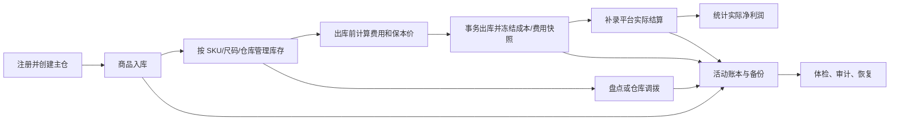
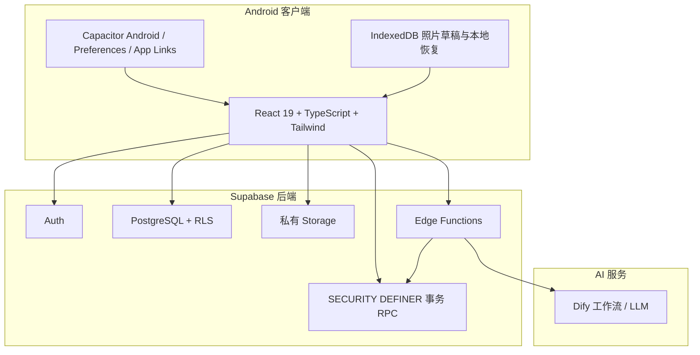

# 卖家库存助手：项目介绍与简历事实材料

> 文档用途：提供给网页端 ChatGPT 或其他简历工具，作为项目经历的事实依据。<br>
> 当前正式基线：v0.21.0，Android 闭测版本。<br>
> 产品声明：个人卖家库存与经营管理工具，非得物官方产品，也未使用得物非公开接口。<br>
> 写作原则：区分“已完成”“正在研究”“未来规划”，不得把规划写成已上线功能。

## 1. 一句话介绍

卖家库存助手是一款面向得物等潮鞋交易场景中个人卖家和小微卖家的 Android 库存经营工具，围绕商品入库、多仓库存、出库核算、平台费用、实际结算、活动账本和 AI 辅助操作，建立了一套可执行、可追踪、可恢复的个人卖家经营账本。

## 2. 项目背景

个人潮鞋卖家通常会同时使用平台卖家端、Excel、备忘录、相册和聊天记录管理生意，容易出现：

- 同一货号包含多个尺码，库存和成本难以准确统计；
- 商品分散在家中、仓库或不同货架，成交后找货慢；
- 入手渠道和采购成本没有统一记录；
- 平台费用、运费和实际结算不同，容易高估利润；
- 重复点击、网络中断或 App 退出可能导致重复入库、重复扣库存；
- 误删、历史异常和版本升级可能造成资产账本不可信；
- 自然语言 AI 能理解意图，但如果直接修改数据库会带来高风险。

项目目标不是复刻大型 ERP，而是为小微卖家提供一套手机优先、容易上手，同时在数据安全和财务口径上足够严谨的经营工具。

## 3. 目标用户

当前重点用户：

- 拥有 0–20 双库存的个人或兼职卖家；
- 拥有 20–100 双库存、需要记录多尺码和真实利润的稳定卖家；
- 拥有 100–500 双库存、开始使用多仓、货架、批量操作的小工作室；
- 以得物为主要销售渠道，同时可能通过闲鱼、微信或同行渠道成交的卖家。

## 4. 已经完成的产品功能

### 4.1 用户与首用流程

- Supabase 邮箱账号注册、登录和会话管理；
- 邮箱确认、密码恢复和 Android App Link 回跳；
- 新用户首次进入时创建第一个主仓，并直接衔接首次入库；
- 头像和昵称资料编辑；
- 深色模式；
- 账号删除及关联业务数据清理；
- 隐私政策、账号删除说明和支持入口。

### 4.2 商品入库

- 记录货号、商品名称、品牌、尺码、成本、数量、仓库、库位、来源和状态；
- 明确标注必填与选填字段；
- 同一款商品可在一次操作中录入最多 12 个尺码；
- 货号输入时联想当前账号已有库存，最多返回 5 条；
- SKU 自动标准化为大写，统一品牌空值和尺码格式；
- 支持 JPEG、PNG、WebP 原图，校验真实文件签名、尺寸和像素上限；
- 照片压缩为受控 JPEG 后上传私有存储；
- 入库表单草稿按账号隔离保存，App 中断或重载后可以恢复；
- 同一 SKU、尺码和仓库再次入库时，数据库事务内合并库存并计算加权平均成本；
- 批量入库使用稳定 operationId，网络响应丢失后重试不会重复增加库存。

### 4.3 库存与仓库管理

- 最多管理 6 个仓库，可设置主仓、重命名和删除空仓；
- 展示总库存、总预估价值、当前仓库存量和当前仓价值；
- 按在售、采购运输中、已售、瑕疵等状态筛选；
- 支持货号、名称和品牌搜索；
- 搜索结果按商品聚合，同一货号只显示一张主卡；
- 每个唯一尺码展示库存数量和按库存加权的平均成本；
- 同货号、尺码在不同仓库仍保持独立库存变体；
- 商品资料编辑与库存/成本调整分离，避免普通编辑直接改账；
- 支持批量选择和软删除；
- 回收站可以恢复商品，恢复冲突时数据库原子合并库存和成本；
- 仓库调拨保证总库存和总成本守恒，并记录独立调拨流水；
- 采购运输中商品只能通过受审计的到仓操作转为在库。

### 4.4 出库、费用与利润

- 从在库商品中搜索并选择准确的 SKU、尺码和仓库变体；
- 校验出库数量为正整数且不得超过当前库存；
- 售价必须明确填写，允许真实的 0 元出库，但不会错误地回退为成本；
- 支持多个费用方案；
- 支持比例费用、固定费用、运费和其他费用；
- 每项费用可选择按件或按整笔交易计算；
- 支持费用生效时间、默认方案和手动总费用覆盖；
- 出库前计算成交额、预计平台费用、预计到手、预计净利润和净利率；
- 支持按目标净利润或目标净利率反算最低售价和保本价；
- 出库时冻结成本与费用快照，避免后续修改费用方案导致历史利润漂移；
- 原子扣减库存并写入唯一出库流水；
- operationId 幂等保护防止重复出库。

### 4.5 实际结算

- 对已出库交易补录实际平台费用、实际到手和结算时间；
- 使用出库时冻结的成本计算实际净利润；
- 预计利润与实际利润分别统计，不混为一谈；
- 支持 0 元费用、负到手等真实异常情况；
- 每次结算更正都生成审计版本；
- 结算时间不得早于出库时间；
- 直接伪造或跨账号写入会被数据库权限拒绝。

### 4.6 统计与经营分析

- 本自然月销售额、销售成本、毛利润、毛利率、预计净利润和实际净利润；
- 近 30 天趋势与自然月统计使用不同且明确的时间口径；
- 缺少成本的销售不会按 0 成本虚增利润；
- 显示成本覆盖率和缺失成本件数；
- 库存品牌占比、热销商品和历史销售统计；
- 大账本统计通过服务端权威聚合，避免只统计前 1000 行或当前页面；
- 非正数历史异常不会伪装成正常 1 件参与统计。

### 4.7 完整活动账本

- 云端分页查看完整库存活动；
- 支持按名称、货号、类型、仓库和时间范围查询；
- 覆盖入库、出库、采购运输、调拨、恢复和库存调整等类型；
- 展示数量、单价、成本、合计、平台、来源和准确时间；
- 支持待结算和已结算筛选；
- 历史异常流水仍保留可见，但明确标注不计入统计。

### 4.8 数据安全、备份与恢复

- 商品使用软删除和回收站，不允许客户端直接物理删除核心账本；
- 提供库存 CSV 快照导出，并防止 Excel 公式注入；
- 提供完整 JSON 账本包，包含商品、回收站、仓库、流水、费用方案、费用快照、结算审计和库存调整审计；
- 账本包包含 schemaVersion、导出时间、数量统计和 SHA-256 完整性校验；
- 恢复前进行服务端预检，展示新增、合并、跳过、冲突和隔离项；
- 恢复过程使用单事务、字段白名单、大小上限和幂等 operationId；
- 重复恢复同一备份不会重复创建库存或流水；
- 异常载荷进入本人可见的隔离区，不直接污染核心账本；
- 支持多代备份兼容，旧格式可以安全读取；
- 图片文件不打包进账本，文档中明确说明该边界。

### 4.9 数据体检与审计修复

- 识别负库存、非正数流水、孤立仓库等历史异常；
- 普通前端编辑和直接数据库更新均不能修改受保护的异常数据；
- 修复操作要求填写目标数量、目标状态和依据；
- 修复只能通过专用事务 RPC 完成，并写入审计记录；
- 未经用户确认，不自动把历史负库存归零或删除异常流水。

### 4.10 AI 库存管理

- 使用 Dify 工作流理解用户自然语言意图；
- Supabase Edge Function 在服务端调用模型，模型密钥不进入客户端；
- 支持库存总结、指定货号库存查询、入库计划和出库计划；
- 查询类请求使用数据库权威结果，不让模型编造库存数字；
- 执行类请求必须包含操作类型、品牌、货号和尺码；
- 数量缺失时可按规则默认为 1，仓库缺失时使用已确认主仓，成本缺失可按规则为 0；
- AI 返回的商品图片 URL 不被信任；
- 入库、出库意图互相冲突时要求澄清；
- 计划生成后需要用户确认，10 分钟过期且只能执行一次；
- 计划 token 封装真实动作，确认时以后端签名内容为准；
- 服务端幂等账本防止同一 AI 计划重复修改库存；
- 未知仓库、库存不足、售价缺失或主数据不可信时阻断执行；
- AI 最终仍调用与手工操作一致的事务 RPC 和业务校验。

### 4.11 Android 与发布工程

- 使用 Capacitor 将 React 应用打包为 Android App；
- Android 包名：`com.hendrikhu.sellerinventory`；
- 支持签名 Release APK 和 AAB；
- 当前 targetSdk/compileSdk 为 API 36；
- Android 使用本地打包资源，不依赖线上网页作为产品入口；
- 生产 Web 不提供库存业务，只保留 Android 使用说明、认证回跳、隐私、账号删除和支持页面；
- Android App Links 与线上 `assetlinks.json`、发布证书绑定；
- 提供 Web/Android 分离构建，构建门槛会阻止业务页面意外发布到 Web；
- 非关键页面和大型图表采用懒加载，降低首屏体积；
- 旧版本 chunk 失效时只自动刷新一次，离线或普通网络错误保留局部重试；
- CSP、`nosniff`、frame denial 等生产安全头已配置；
- 提供隐私安全的支持诊断，只上传白名单错误信息和匿名诊断 ID。

## 5. 核心业务流程



## 6. 技术架构



### 6.1 前端与移动端

- React 19、TypeScript、Vite；
- Tailwind CSS、Lucide React、Recharts；
- Capacitor Android、App、Browser、Preferences 插件；
- 组件化页面和模态任务流；
- 账号级状态隔离、懒加载和错误边界。

### 6.2 后端与数据层

- Supabase Auth；
- PostgreSQL；
- Row Level Security 按 `auth.uid()` 隔离用户数据；
- 事务 RPC 承担入库、出库、调拨、恢复、调整、结算和账号删除；
- Supabase Storage 保存私有商品图与头像；
- Edge Functions 承担 AI 管理、头像上传和账号删除边界；
- 时间戳迁移文件是数据库结构、RLS、RPC 和存储策略的唯一演进来源。

## 7. 项目中的关键工程难题

### 7.1 防止重复写库存

移动端可能出现双击、网络超时、切换 App 或收到未知响应。项目没有简单地“禁用按钮”，而是：

- 在草稿创建时生成稳定 operationId；
- 请求与 operationId 绑定；
- 数据库幂等账本记录执行结果；
- 同一请求重放时返回首次结果，不重复入库、出库或调拨；
- 相同 operationId 携带不同参数时拒绝执行。

### 7.2 保证库存与成本口径一致

- 变体按用户、SKU、尺码和仓库识别；
- 并发操作使用统一锁域与固定锁顺序；
- 重复入库和恢复冲突在事务内合并；
- 平均成本按库存数量加权，不按记录条数平均；
- 调拨只改变位置，不改变总数量和总成本。

### 7.3 让利润可以解释和追溯

- 出库前费用只是预计；
- 出库时冻结当时成本和费用方案快照；
- 平台最终费用通过结算补录；
- 预计净利润与实际净利润分开统计；
- 缺成本或费用未知时显示未知，不伪装成 0；
- 结算更正保留审计版本。

### 7.4 控制 AI 执行风险

- 模型只负责理解意图和生成计划；
- 数据库权威数据和业务规则由服务端重新校验；
- 用户确认前不写库；
- 计划带签名、过期时间和一次性约束；
- 确认后仍通过原有事务 RPC 执行；
- 模型的图片、商品名、仓库和金额不能绕过业务校验。

### 7.5 可恢复而不是静默修正

- 删除使用软删除；
- 异常数据通过体检展示；
- 修复必须填写依据并留审计；
- 备份恢复先预检再执行；
- 冲突和损坏记录进入隔离区；
- 历史异常不未经授权自动归零。

## 8. 可量化的项目事实

截至 2026-08-12，本地仓库可复核：

- 33 个 Git 版本标签，正式基线从 v0.1 持续演进到 v0.21.0；
- 39 个时间戳数据库迁移；
- 41 个测试文件；
- 176 项自动化测试全部通过；
- 26 个 React 业务组件；
- 18 个前端数据服务模块；
- 3 个线上 Edge Functions；
- Android targetSdk/compileSdk 36；
- v0.21.0 Release APK、AAB 和发布证书均保存 SHA-256 校验值；
- v0.21.0 发布记录中，TypeScript、生产构建和生产依赖审计通过，生产依赖漏洞为 0；
- 生产 Web 与 Android 业务包采用不同构建目标，Web 构建中库存业务 chunk 数为 0。

注意：这些数字用于说明工程规模与质量门槛，不等于真实用户数、收入或商业转化。

## 9. 版本演进摘要

| 阶段 | 代表版本 | 主要成果 |
| --- | --- | --- |
| 核心库存安全 | v0.3–v0.6 | 回收站、批量入库、调拨、AI 幂等、RLS、数据约束、体检修复 |
| 账本与财务 | v0.7–v0.10 | 完整账本、备份恢复、费用方案、实际结算、反算售价 |
| 数据一致性 | v0.11–v0.15 | 仓库完整性、受审计调整、大账本统计、服务端分页、采购运输语义 |
| 移动可靠性 | v0.16–v0.18 | 图片草稿、首用闭环、懒加载和首屏性能 |
| 发布与隐私 | v0.19–v0.21 | 安全诊断、头像存储、最小权限、公开发布门槛、Android-only 产品入口 |

## 10. 当前状态与诚实边界

### 10.1 当前状态

- v0.21.0 为当前正式 Android 闭测基线；
- 本地开发环境可以在浏览器完整预览，正式产品入口是 Android App；
- 已生成签名 APK/AAB，但没有通过公开应用商店正式发布；
- GitHub 已保存版本历史、标签和发布记录；
- 当前另有 v0.22.0 移动体验视觉草稿，尚未提交、合并或发布。

### 10.2 公开发布阻断

- 尚未配置用户自有 HTTPS 域名；
- 尚未配置并验收 Custom SMTP 的真实注册确认与密码恢复邮件链；
- 因此当前只能诚实描述为闭测版本，不能写成公开上线产品。

### 10.3 尚未完成的能力

- 未接入得物开放平台，不能实时同步个人得物账号订单；
- 未使用爬虫、自动化登录或非公开接口抓取得物数据；
- 鞋盒标签 OCR 和条码扫码识别尚未正式实现；
- 跨用户共享的标准商品库尚未建设；
- 得物订单、待发货、平台鉴别、鉴别失败、退回和结算尚未形成完整订单状态机；
- 商品主数据、尺码变体和仓库库存仍需要进一步彻底分层；
- 尚无可公开证明的用户规模、留存率、收入或效率提升数据。

## 11. 接下来计划做什么

项目目前处于产品研究优先阶段，先验证小微卖家的真实任务，再决定下一轮信息架构。

### 11.1 产品研究

- 访谈不同库存规模的个人卖家和小工作室；
- 收集脱敏的鞋盒标签、订单、结算、退回和当前记账方式；
- 使用统一任务基准测试入库、查货、报价、发货和恢复；
- 验证首页应该优先展示新增、待办、查货还是经营数字。

### 11.2 商品库与快速入库

- 建立商品主数据、尺码变体和用户库存的分层模型；
- 研究用户纠错和商品候选合并机制；
- 拍摄鞋盒侧标后 OCR 提取品牌、货号、尺码和条码；
- 扫描条码或二维码后查询商品候选；
- 展示识别来源、时间和置信度；
- 所有识别结果先进入可编辑草稿，用户确认后才入库。

### 11.3 卖家订单闭环

- 将成交、待发货、平台收货、鉴别、结算、退回和退款建模为独立状态；
- 把库存占用、实际扣减和逆向恢复与订单状态关联；
- 建立待办和超时提醒；
- 让实际平台结算自动关联对应销售订单。

### 11.4 正式发布

- 配置自有域名与 Custom SMTP；
- 完成真实注册和密码恢复整链验收；
- 建立可信 Android 分发渠道、版本校验与升级策略；
- 完成小规模闭测、可用性测试和异常恢复演练后再公开发布。

## 12. 推荐的简历项目名称

以下名称按岗位侧重点选择：

- 产品岗：**卖家库存助手｜小微潮鞋卖家经营管理 Android App**
- 全栈岗：**Seller Inventory Assistant｜React + Supabase + Capacitor 全栈项目**
- AI 产品岗：**可控 AI 库存管理与小微卖家经营工具**
- 移动端岗：**Android 小微卖家库存与利润管理 App**

不要使用“得物官方库存系统”“得物开放平台合作项目”等名称。

## 13. 可直接用于简历的版本

### 13.1 一行版

独立设计并实现面向潮鞋个人卖家的 Android 库存经营工具，覆盖多尺码入库、多仓调拨、费用与实际利润核算、AI 可确认操作、完整账本备份恢复，并通过 Supabase RLS、事务 RPC 和幂等机制保障库存数据安全。

如果并非独立完成，应把“独立设计并实现”改成真实职责，例如“主导产品设计并参与核心工程实现”。

### 13.2 四条项目经历版

- 面向得物等潮鞋交易场景的小微卖家，完成 Android 库存经营 App 的产品设计与全栈实现，支持商品/尺码/仓库库存、批量入库、调拨、出库和完整活动账本。
- 设计费用方案、保本价反算、预计/实际结算分离和成本覆盖率，解决平台费用变化、缺成本记录和利润虚高问题，并保留费用快照与结算更正审计。
- 基于 Supabase PostgreSQL、RLS、事务 RPC、advisory lock 和 operationId 幂等账本，实现入库、出库、调拨、恢复等关键操作的原子性与重复请求防护。
- 将 Dify/LLM 限制为“理解意图并生成计划”，通过服务端签名、10 分钟过期、一次性确认和权威数据复核后执行；项目累计 39 个数据库迁移、41 个测试文件，当前 176 项自动化测试通过。

### 13.3 产品经理版

- 从个人卖家库存分散、尺码复杂、平台费用不透明和利润难核算的问题出发，定义“入库—查货—成交核算—结算—恢复”的核心用户旅程。
- 将商品、尺码、仓库、成本、费用、预计利润和实际结算纳入统一账本，设计批量尺码入库、多仓调拨、保本价反算、回收站和数据体检等关键功能。
- 针对 AI 直接改库存的风险，设计“自然语言理解—结构化计划—用户确认—服务端重校验—一次性执行”的可控交互闭环。
- 建立小微卖家竞品研究和 T1–T10 任务基准，明确下一阶段优先验证快速入库、实物找货、订单状态链和商品库/OCR，而非继续堆叠功能。

### 13.4 全栈开发版

- 使用 React 19、TypeScript、Vite、Tailwind CSS 和 Capacitor 开发 Android 库存管理客户端，并通过 Supabase Auth、PostgreSQL、Storage 和 Edge Functions 构建后端。
- 以 RLS 和 `auth.uid()` 实现多租户数据隔离，通过 SECURITY DEFINER RPC、数据库约束和固定锁顺序处理并发入库、出库、恢复与反向调拨。
- 使用稳定 operationId 和服务端幂等账本处理双击、超时和未知响应，保证重复请求不重复修改库存，同时拒绝同 ID 的篡改请求。
- 建立 39 个可追溯数据库迁移、41 个测试文件和多目标构建门槛；当前 176 项自动化测试通过，Android 构建目标为 API 36。

### 13.5 AI 产品/应用开发版

- 基于 Dify 工作流和 Supabase Edge Function 构建 AI 库存助手，支持库存总结、SKU 查询、入库和出库意图解析。
- 将模型输出限制为结构化计划，服务端使用数据库权威库存、主数据和费用规则重新校验，避免模型直接写库或编造执行结果。
- 通过签名 token、planId、签发/过期时间和服务端幂等账本，实现计划 10 分钟有效、只执行一次、重复确认不重复扣减库存。
- 针对混合意图、未知仓库、缺失售价、库存不足、模型图片 URL 和主数据漂移设计阻断规则，使 AI 与手工操作复用同一事务业务层。

## 14. 面试时最值得讲的四个故事

### 故事一：为什么不能只靠前端禁用按钮

可以讲移动网络超时和双击如何导致重复库存写入，以及如何用稳定 operationId、数据库幂等账本和请求指纹解决。

### 故事二：为什么预计利润和实际利润必须分开

可以讲平台费、运费和最终结算会变化，如何冻结出库成本和费用快照，再用实际结算与更正审计建立可信利润。

### 故事三：为什么 AI 不能直接操作数据库

可以讲模型会误解数量、尺码和金额，如何把 AI 降级为计划生成器，并由服务端权威数据和事务 RPC 掌握最终执行权。

### 故事四：为什么数据恢复是产品功能

可以讲个人卖家最怕成本和库存丢失，如何通过软删除、完整账本、SHA-256、恢复预检、隔离区和幂等恢复提高信任。

## 15. 简历写作边界

### 可以写

- Android 闭测版本；
- React + TypeScript + Supabase + Capacitor；
- 库存、仓库、费用、结算、AI、备份恢复；
- 176 项测试、39 个迁移、33 个版本标签；
- 签名 APK/AAB 和 API 36；
- RLS、事务、幂等、审计和数据恢复。

### 暂时不能写

- 得物官方合作或官方接口接入；
- 实时同步得物账号和订单；
- 已正式上架应用商店；
- 已有大量真实用户；
- OCR/扫码商品识别已经上线；
- 已建成标准潮鞋商品库；
- 已实现完整鉴别、退回和退款订单链；
- 真实提升卖家效率百分比，除非以后通过测试取得数据。

## 16. 给网页端 ChatGPT 的使用提示

可以把本文件完整提供给 ChatGPT，并附上以下要求：

```text
请根据这份事实材料帮我写简历项目经历。

要求：
1. 不得把规划中的 OCR、商品库、得物订单同步写成已完成功能。
2. 不得称为得物官方项目或公开上线产品。
3. 重点突出我实际负责的产品设计、业务建模、全栈实现、AI 安全和数据可靠性。
4. 使用“问题—行动—技术难点—结果”的结构，不要堆砌技术名词。
5. 保留可核实的数据：176 项测试、39 个迁移、41 个测试文件、33 个版本标签、Android API 36。
6. 先输出一版适合产品经理岗位，再输出一版适合全栈/AI 应用开发岗位。
7. 每版控制在 4 条要点，每条不超过两行。
8. 若需要描述我的个人职责，请先询问，不要自行假设团队人数或独立完成比例。
```

## 17. 事实来源

- `README.md`
- `package.json`
- `capacitor.config.ts`
- `components/`
- `services/`
- `supabase/functions/`
- `supabase/migrations/`
- `tests/`
- `docs/releases/v0.21.0.md`
- `docs/releases/final-rc-audit.md`
- `docs/product/competitive-research-2026-08-11.md`
- `docs/product/micro-seller-competitive-research-2026-08-12.md`
- Git tags and release history through v0.21.0
